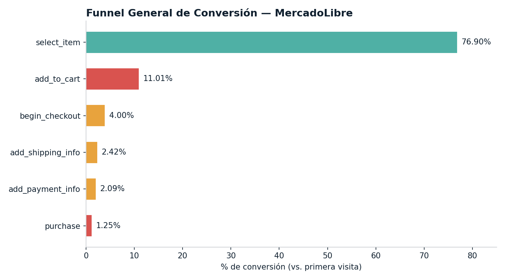
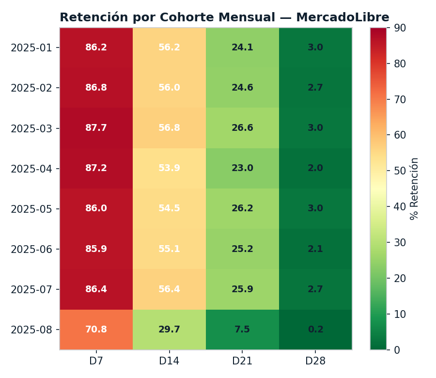
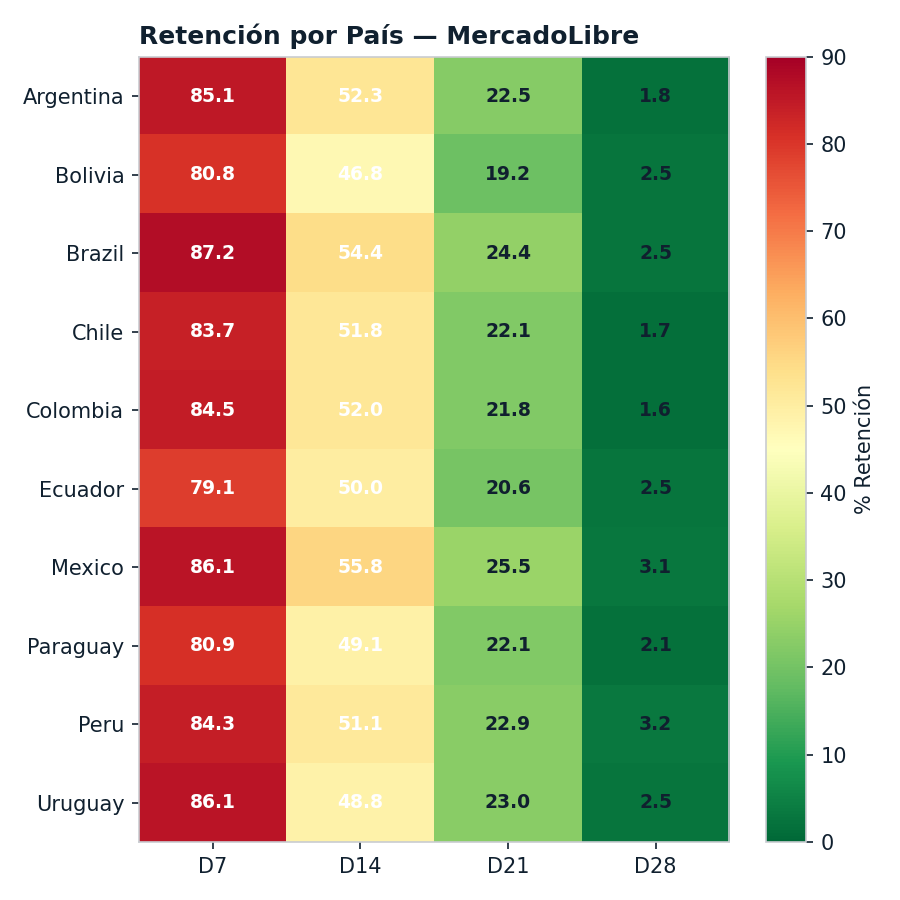

# Análisis de Embudo y Retención — MercadoLibre

**Autor:** Sergio Alberto Santoyo Ambriz — Certificado de Analista de Datos, TripleTen (2026)
**Stack:** SQL (CTEs) · Análisis de Embudo (Funnel Analysis) · Análisis de Cohortes

Como analista de producto en el equipo de Crecimiento y Retención de MercadoLibre, mapeo el embudo de conversión completo (desde la primera visita hasta la compra) usando SQL, identifico los principales puntos de fuga, y evalúo la retención de usuarios por cohortes y por país, para proponer mejoras accionables basadas en datos.

## Preguntas de negocio

- Entre el 01/01/2025 y el 31/08/2025, ¿cuál es la tasa de conversión entre cada etapa clave del embudo?
- ¿En qué paso se observa la mayor caída porcentual de usuarios?
- ¿Cómo varía esta pérdida por país?
- Para usuarios registrados entre enero y junio de 2025, ¿cuál es la tasa de retención en D7, D14, D21, D28?
- ¿Cómo se comporta la retención por país?

## Metodología

1. Construcción de embudos multietapa en SQL usando CTEs
2. Cálculo de tasas de conversión entre pasos y detección de caídas
3. Segmentación del embudo por país
4. Análisis de retención de usuarios por cohortes mensuales (D7/D14/D21/D28)
5. Segmentación de retención por país
6. Redacción de informe ejecutivo con hallazgos e implicaciones de negocio

## Hallazgos clave

### Embudo de conversión

| Etapa | % de conversión (vs. primera visita) |
|---|---|
| select_item | 76.90% |
| add_to_cart | 11.01% |
| begin_checkout | 4.00% |
| add_shipping_info | 2.42% |
| add_payment_info | 2.09% |
| purchase | 1.25% |



- **Alta atracción inicial:** ~77% de los usuarios interactúa con productos.
- **Caída crítica en Select → Add to Cart:** -66 puntos porcentuales — el mayor punto de fuga de todo el embudo, antes incluso de llegar al carrito.
- **Conversión final muy baja:** apenas 1.25%.
- **Por país:** Uruguay lidera en todas las etapas; Brasil y Paraguay presentan caídas tempranas; Ecuador y Colombia pierden el 100% de sus usuarios antes de completar una compra.

### Retención por cohortes



- **D7:** más del 85% de los usuarios permanece activo la primera semana.
- **D7 → D14:** caída fuerte — se pierde ~30% de los usuarios.
- **D14 → D21:** deserción progresiva — solo 1 de cada 4 usuarios sigue activo.
- **D28:** retención crítica — solo ~2-3% sigue activo (>97% de abandono).

### Retención por país



Los promedios de retención son similares entre países, con una caída fuerte y consistente después de la semana 2 — el problema de retención no es geográfico, es estructural.

## Implicaciones de negocio

- El principal problema no está en atraer usuarios, sino en **convertirlos** (fuga en Select → Add to Cart) y en **retenerlos** (caída post-D14).
- Un D28 tan bajo implica que el costo de adquisición (CAC) difícilmente se recupera, reduciendo el LTV y afectando la escalabilidad del negocio.
- Posibles causas del abandono en el carrito: precios poco competitivos, falta de confianza, UX deficiente en ficha de producto, costos ocultos.

## Recomendaciones

1. Priorizar la optimización de la etapa **Select → Add to Cart**, por ser el mayor punto de fuga con el mayor impacto potencial en la conversión final.
2. Diseñar estrategias locales por país (métodos de pago, logística, confianza, precios regionales), usando Uruguay como benchmark interno.
3. Invertir en retención más que en adquisición: programas de lealtad, promociones post-compra, recomendaciones personalizadas, remarketing temprano y optimización post-checkout.

## Reflexión personal

> **¿Qué etapa mejorarías primero?** Priorizaría la etapa Select → Add to Cart, ya que presenta la mayor pérdida de usuarios y tiene el mayor impacto potencial en la conversión final.
>
> **¿Qué aprendiste sobre el comportamiento del usuario?** Los usuarios muestran alto interés inicial, pero baja intención real de compra. Además, existe una fuerte deserción después de la segunda semana, lo que indica problemas de engagement y valor percibido.

## Estructura del repositorio

```
├── images/
│   ├── funnel_general.png
│   ├── retencion_pais.png
│   └── retencion_cohorte.png
├── Proyecto_4__Análisis_de_embudo_y_retención_para_MercadoLibre_-_Resumen_ejecutivo.xlsx
└── README.md
```

## Contacto

[LinkedIn](https://www.linkedin.com/in/sergio-alberto-santoyo-ambriz-12b458179) · sergio.santoyo.ambriz@gmail.com
